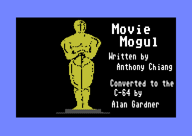

# Movie Mogul

Movie Mogul is an ancient C=64 game that came on a LoadStar floppy in the late 80s.

I used to play this game all of the time as a teenager.

Back in 2015, I found the code, and had the idea of creating a web based game out of it.

I never did it.

Now that it's 2026, I thought it might be fun to look at this using some of the tools that are available now to see if I could convert this and bring myself, and maybe others, some joy.



---

## About the Game

You play as a Hollywood producer. Pick one of three scripts, cast your stars, set your production budget, and see how your film performs at the box office — and maybe at the Academy Awards.

### Game phases

1. **Scripts** — Three movies are pitched to you. Read the descriptions, note the role requirements, and pick the one you want to produce.
2. **Casting** — A pool of 12 actors (4–8 male, remainder female) is drawn from 140. Each has a salary demand. Cast three roles.
3. **Production budget** — Set your budget. Spending more improves quality up to a cap. Production events may help or hurt you.
4. **Critics** — Nine reviewers (Siskel, Ebert, Variety, and others) screen your film. Their verdicts drive your review score.
5. **Box office** — Your film opens with a sneak preview, then runs week-by-week. A good film has "legs"; a bad one collapses quickly.
6. **Academy Awards** — Every film has a shot at Best Actress, Best Actor, and Best Picture. Winning triggers a re-release bonus.
7. **Summary** — Final profit or loss is tallied.
8. **High scores** — Four leaderboard categories: Highest Profit, Greatest Revenue, Best % Returned, and Biggest Bomb.

### URL parameters

| Parameter | Effect |
|-----------|--------|
| `?seed=N` | Deterministic RNG — same seed produces the same game (used by E2E tests) |
| `?cheat`  | Shows actor role-fit stats in the casting screen (standalone build only) |

---

## Development

### Prerequisites

- Node.js 18+
- `npm install`

### Commands

```bash
npm run dev            # Vite dev server at http://localhost:3000 (standalone)
npm run build          # Standalone build (localStorage high scores only)
npm run build:global   # API-enabled build (VITE_SCORES_API=1, Cloudflare leaderboard)
npm run test           # Vitest unit tests (watch mode)
npx vitest run         # Unit tests, run once
npm run coverage       # Unit test coverage report
```

### Testing

The project uses BDD dual-loop TDD: every feature starts as a failing Playwright (browser) scenario, then is driven inward through Vitest unit tests.

#### Unit tests

Tests are co-located with source files (`gameEngine.ts` → `gameEngine.test.ts`).

```bash
npx vitest run                               # all tests once
npx vitest run src/game/gameEngine.test.ts   # single file
npm run coverage                             # coverage report
```

#### E2E tests (Playwright BDD / Cucumber)

```bash
# Standalone — all features, 4 browsers (Chrome, Firefox, iOS WebKit, Android)
npm run test:e2e

# API build — api-*.feature only, Chrome, served via wrangler pages dev
npm run test:e2e:api

# Both suites sequentially
npm run test:e2e:all
```

Run against a deployed build instead of starting a local server:

```bash
BASE_URL=https://your-site.pages.dev npm run test:e2e
BASE_URL=https://your-site.pages.dev npm run test:e2e:api
BASE_URL=https://your-site.pages.dev npm run test:e2e:all
```

Feature files live in `e2e/features/`, one per game phase. Reports are written to `playwright-report/` (HTML) and `test-results/junit.xml`.

**First-time setup on Linux** — WebKit (iOS) requires system libraries:
```bash
npx playwright install-deps webkit
# If that fails:
sudo apt-get install -y libavif16
```

---

## Architecture

Plain TypeScript, no framework. The game renders into a `<div id="output">` to simulate a C64-style terminal.

```
src/
  data/           actors.ts, movies.ts  — 140 actors and 12 movies from C64 data files
  game/           gameEngine.ts         — pure functions; all randomness is injected
                  gameState.ts          — GameState type and initial state
                  phaseHelpers.ts       — production events, reviews, overrun, release summary
                  highScores.ts         — 4-category leaderboard with localStorage persistence
  ui/             renderer.ts           — print(), clearScreen(), readLine(), waitForKey()
                  format.ts             — money formatting
  api/            client.ts             — Cloudflare Worker API client (global build only)
  main.ts                               — full 8-phase game loop

functions/
  api/scores.ts                         — Cloudflare Pages Function: global leaderboard via D1

e2e/
  features/                             — Gherkin scenarios, one per game phase
  steps/                                — step definitions (shared.steps.ts has all navigation)
  pages/                                — page objects, one per phase
```

### Two builds

| Build | Command | High scores |
|-------|---------|-------------|
| Standalone | `npm run build` | localStorage only |
| Global | `npm run build:global` | Cloudflare D1 global leaderboard |

---

## Deployment

There are two deployment targets:

```bash
# Standalone build → mcornell.dev (Astro site, rsync)
# Set DEPLOY_TARGET in .env.local, or you'll be prompted
npm run deploy

# API-enabled build → Cloudflare Pages + D1 global leaderboard
npm run deploy:global
```

`deploy:global` requires `wrangler` authenticated with Cloudflare. The `wrangler.toml` configures two D1 bindings: preview (local dev + CI) and production.

To reset the D1 database to blank placeholder entries:
```bash
./scripts/reset-db.sh
```

---

## Fidelity to the original

All game formulas are verified against the original C64 BASIC source (`c64/movie mogul.prg`).

One known bug is preserved intentionally: the Oscar eligibility check uses the first cast member's star power for all three actors (C64 variable `ao(3)` rather than `tw(3)`/`tr(3)` for actors 2 and 3). The original does this and so does this port.

The annotated source (`c64/movie mogul formatted.prg`) and `docs/game-analysis.md` document all formulas, variable mappings, and the Oscar bug in detail.

---

## Project organization

```
c64/             Original C64 files: the BASIC source (.prg), actor and movie data (.seq),
                 disk image (.d64), and the original LoadStar article/manual
docs/            game-analysis.md — full mechanics breakdown with formulas and Mermaid diagrams
util/            Ruby scripts used to convert the C64 sequential data files to TypeScript
                 (left for reference)
```

---

## Credits

Original game: **© 1985 Chiang Brothers Software**  
Written by Anthony Chiang · Converted to C-64 by Alan Gardner  
Published in *LoadStar* magazine (Softdisk Publishing)

Browser port by Mike Cornell
