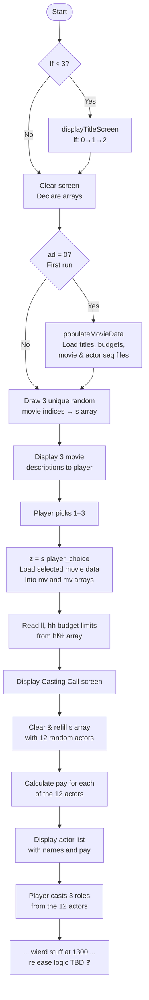
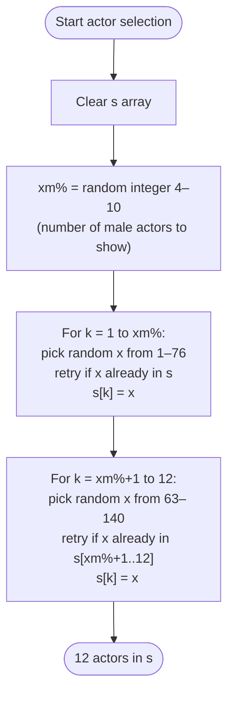
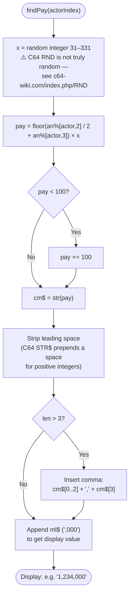
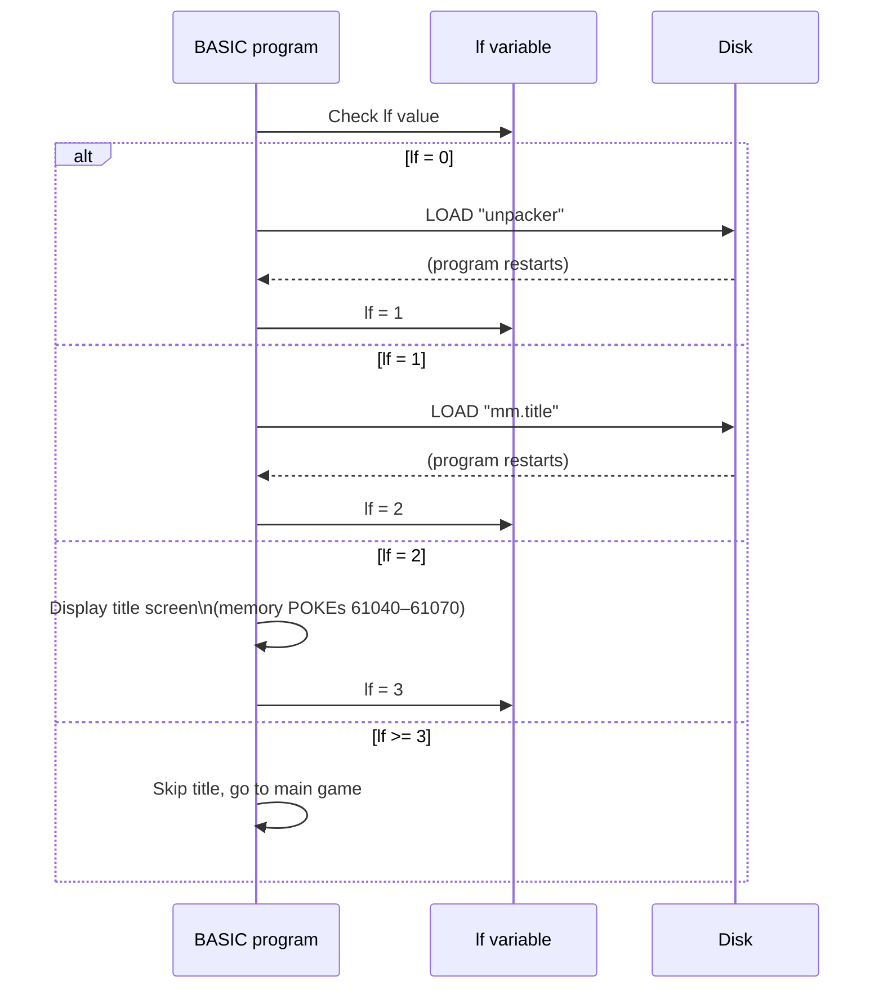

# Movie Mogul — C64 Game Analysis

This document is a revised and annotated version of the original `c64/pseudocode.txt` notes,
cross-referenced against the actual data files (`c64/actor data.seq`, `c64/movie data.seq`)
and the Ruby conversion utilities (`util/convert_actor.rb`, `util/convert_movie.rb`).

**Legend:**
- ✅ Confirmed — verified against data files or Ruby scripts
- ⚠️ Inferred — reasonable interpretation, not yet verified against the .prg binary
- ❓ Unknown — not yet understood

---

## Data Structures

### Actor (`ac$` / `an%`)

Declared as `ac$(140)` (names) and `an%(140, 8)` (stats). ✅ Confirmed via `actor data.seq` (140 actors × 9 lines each).

| Array index | Field | Notes |
|---|---|---|
| `an%[j, 1]` | gender | `1` = Male, `9` = Female ✅ (no `5` seen in actor data) |
| `an%[j, 2]` | pay seed | Used in pay formula: `an%[j,2] / 2` ✅ |
| `an%[j, 3]` | pay additive | Used in pay formula: `+ an%[j,3]` ✅ |
| `an%[j, 4..8]` | scoring stats | Used in awards/release scoring ⚠️ — exact meaning unknown ❓ |

### Movie (`mn$` / `mn%`)

Declared as `mn$(12, 6)` (strings) and `mn%(12, 3, 8)` (casting requirements). ✅ Confirmed via `movie data.seq` (12 movies × 29 lines each).

| Index | Field | Notes |
|---|---|---|
| `mn$[j, 1]` | title | Loaded from BASIC DATA statements in .prg ✅ |
| `mn$[j, 2..3]` | description | Two-line description from seq file ✅ |
| `mn$[j, 4..6]` | role names | Three role names from seq file ✅ |
| `mn%[j, role, 1]` | role gender req | `1`=Male only, `5`=Either, `9`=Female only ✅ |
| `mn%[j, role, 2]` | unknown | Always appears to be ignored ⚠️ |
| `mn%[j, role, 3]` | awards skill | Actor stat weighting for awards calculation ⚠️ |
| `mn%[j, role, 4]` | release skill | Actor stat weighting for initial box office ⚠️ |
| `mn%[j, role, 5..8]` | other attrs | Purpose unknown ❓ |

### Budget (`hl%`)

Declared as `hl%(12, 2)` — two values per movie. ✅ Confirmed via `convert_movie.rb` which names them `budget_min` and `budget_ideal`.

### Unresolved Arrays ❓

| Variable | Declaration | Notes |
|---|---|---|
| `ad(8)` | float, size 8 | `ad` is used as a boolean flag (0=not loaded, 1=loaded). The array may track something else. |
| `tw(8)` | float, size 8 | Unknown. Possibly tracks total wages? |
| `tr(8)` | float, size 8 | Unknown. Possibly tracks total revenue? |
| `dimpy(12)` | float, size 12 | Likely "dim pay" — per-movie pay tracking. Possibly total cast payroll. |
| `fg$(4, 5)` | string, 4×5 | Unknown. Possibly fame/glory tracking per player? |
| `jj$(4, 5)` | string, 4×5 | Unknown. |
| `kk$(4, 5)` | string, 4×5 | Unknown. Possibly the same kind of data as `fg$`/`jj$`. |

> **Note:** The `4×5` shape of `fg$`, `jj$`, `kk$` is suggestive of up to 4 players with 5 attributes each, but this is speculative. ❓

---

## Game Flow

---

## Algorithm: Actor Pool Selection

The `s` array (size 12) is **reused** for two purposes: first to hold 3 random movie indices,
then cleared and refilled with 12 random actor IDs for casting.

> ⚠️ **Notable quirk:** The female range is **63–140**, not 77–140.
> Actors 63–76 are male in the data (Michael Keaton, Tom Cruise, Dustin Hoffman, etc.),
> meaning they can appear in both the male *and* female draw pools.
> Whether this is intentional (to staff gender-neutral roles) or a C64 bug is unknown. ❓

---

## Algorithm: Pay Calculation

**Pay scale examples** (using the formula with mid-range random factor ≈ 180):

| Actor | `an%[2]` | `an%[3]` | Base factor | Pay range |
|---|---|---|---|---|
| Pia Zadora | 2 | 2 | 3 | ~93–993K |
| Tom Cruise | 2 | 6 | 7 | ~217–2,317K |
| Marlon Brando | 8 | 7 | 11 | ~341–3,641K |
| Meryl Streep | 4 | 9 | 11 | ~341–3,641K |

> ✅ Formula confirmed: `floor(an%[j,2] / 2 + an%[j,3]) * random(31, 331)`.
> The `+100` floor prevents any actor from quoting less than $100,000.

---

## Startup / Title Screen

The `lf` ("logical file") variable tracks where in the startup sequence we are. ⚠️ This is a C64
loading pattern where separate files are chained via `LOAD`.

---

## Open Questions

1. **Casting input (line 1300+):** The notes say "weird stuff at 1300 later." This is where the player selects actors per role and the scoring begins. Logic is unresolved. ❓

2. **`fg$`, `jj$`, `kk$` arrays:** Three 4×5 string arrays with no documented purpose. Could be multi-player tracking, award history, or something else entirely. ❓

3. **`tw` / `tr` arrays:** Possibly total-wages and total-revenue per movie or per turn, but unconfirmed. ❓

4. **Scoring / release / awards:** The role requirement values at indices 3–8 (`mn%[j, role, 3..8]`) are used in some scoring formula after casting, but the formula is not captured in the pseudocode. ❓

5. **`ll` and `hh` limits:** These come from `hl%[movie, 1]` and `hl%[movie, 2]` and almost certainly correspond to the `budget_min` and `budget_ideal` from the Ruby script. Confirmed by cross-reference, but the actual mechanic (does the player choose a budget? is it auto-calculated?) is unknown. ❓

6. **Female range overlap (63–140):** See note in actor selection above. ❓
