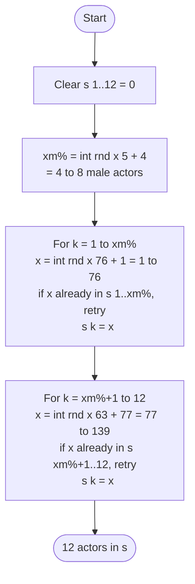
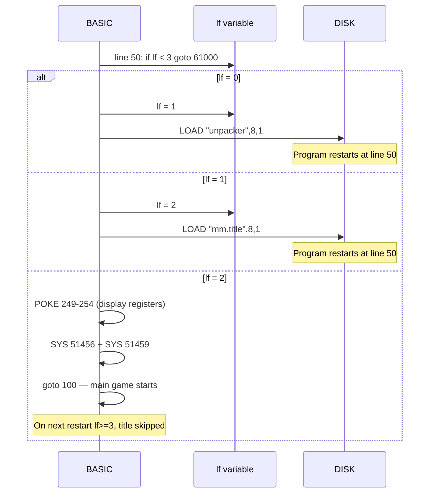

# Movie Mogul — C64 Game Analysis

All information below is confirmed directly from `c64/movie mogul.prg` (a plain-text C64 BASIC
listing), cross-referenced against `c64/actor data.seq`, `c64/movie data.seq`, and the Ruby
utilities. Line numbers refer to the BASIC source.

---

## Variables & Arrays

### Global Variables

| Variable | Type | Notes |
|---|---|---|
| `lf` | scalar | Title-screen load state: 0→1→2→3. Once ≥3, title is skipped on restart. |
| `ad` | scalar | Data-loaded flag. `0` = not yet loaded, `1` = loaded. Separate from `ad(8)` array (C64 BASIC treats them as distinct). |
| `a` | scalar | **Review score accumulator. Starts at 3 (line 180), not 0.** Ranges roughly −1 to ~21 after reviews. |
| `ll`, `hh` | scalars | Budget minimum and ideal (in thousands) for the selected movie. From `hl%`. |
| `mm` | scalar | Player's chosen production budget (in thousands). Capped at `hh` for scoring. |
| `mn` | scalar | Effective budget used in box office formula. `mn = hh` if `mm > hh`; otherwise `mn = mm`. Spending above `hh` gains nothing. |
| `ct` | scalar | Running total **cost** in thousands (salaries + production + overruns). |
| `tt` | scalar | Running total **revenue** in thousands. |
| `mq` | scalar | Master quality score. Drives the box office calculation. |
| `wt` | scalar | Current weekly gross (in thousands). |
| `wk` | scalar | Week counter for theatrical run. |
| `w` | scalar | Oscar win accumulator. +0.4 per acting award, +1.0 for Best Picture. |
| `z` | scalar | Index of the player's selected movie (1–12). |
| `xm%` | scalar | Number of male actors drawn for casting pool (4–8). |

### Arrays

| Array | Declaration | Purpose |
|---|---|---|
| `ac$(140)` | string | Actor names. |
| `an%(140, 8)` | int | Actor stats. `an%[j,1]`=gender, `an%[j,2..8]`=stats[0..6]. |
| `mo$(12)` | string | Movie titles (12 entries). |
| `mn$(12, 6)` | string | Movie string data. `[j,1]`=title, `[j,2-3]`=description lines, `[j,4-6]`=role names. |
| `mn%(12, 3, 8)` | int | Role casting requirements. `[j, role, 1..8]`. |
| `hl%(12, 2)` | int | Budget limits. `[i,1]`=min, `[i,2]`=ideal (in thousands). |
| `s(12)` | float | **Dual-purpose.** First holds 3 random movie indices (s[1..3]); cleared at line 865, then holds 12 actor indices for the casting pool (s[1..12]). |
| `py(12)` | float | **This is `DIM PY(12)` — misread as `dimpy(12)` in original notes.** Holds calculated pay for each of the 12 actors in the casting pool. |
| `ao(8)` | float | Full stats of cast actor 1 (`an%[actor,1..8]`). Loaded at line 1350. |
| `tw(8)` | float | Full stats of cast actor 2. Loaded at line 1420. Name: "**t**wo". |
| `tr(8)` | float | Full stats of cast actor 3. Loaded at line 1490. Name: "**tr**hree". |
| `mv(3, 8)` | float | Role requirements for selected movie. `mv[role, 1..8]` = `mn%[z, role, 1..8]`. |
| `fg$(4, 5)` | string | High score table: movie title per entry. 4 categories × 5 slots. |
| `jj$(4, 5)` | string | High score table: player initials per entry (3–4 chars). |
| `kk(4, 5)` | float | High score table: score value per entry. **Note:** declared as `kk$(4,5)` (string) in the DIM but used throughout as `kk(i,j)` (numeric). In C64 BASIC these are separate variables. `kk$` is never used. |
| `ad(8)` | float | **Declared but never used.** The loaded flag uses the scalar `ad`, not this array. |

### Actor Stats Mapping (`an%[j, 1..8]`)

| BASIC index | TS `stats[]` index | Role in formulas |
|---|---|---|
| `an%[j,1]` | (gender field) | Gender code: `1`=Male, `9`=Female |
| `an%[j,2]` | `stats[0]` | Unknown. Present in data but unused in any confirmed formula. |
| `an%[j,3]` | `stats[1]` | **Star power.** Used in pay formula (÷2), Oscar threshold, Best Picture. |
| `an%[j,4]` | `stats[2]` | **Pay additive.** Used in pay formula (added directly). |
| `an%[j,5..8]` | `stats[3..6]` | Fit stats. Compared against role requirements in `bq` penalty loop. |

### Role Requirements Mapping (`mn%[j, role, 1..8]`)

| BASIC index | TS `requirements[]` index | Role in formulas |
|---|---|---|
| `mn%[j,r,1]` | `requirements[0]` | Gender: `1`=Male only, `5`=Either, `9`=Female only |
| `mn%[j,r,2]` | `requirements[1]` | Unused. |
| `mn%[j,r,3]` | `requirements[2]` | **Prestige.** Used in `aq` quality score and Oscar threshold. |
| `mn%[j,r,4]` | `requirements[3]` | **Quality.** Also used in `aq` score. |
| `mn%[j,r,5..8]` | `requirements[4..7]` | Fit requirements. Compared against actor fit stats in `bq` loop. |

---

## Overall Game Flow

```mermaid
flowchart TD
    A([Start]) --> B{lf < 3?}
    B -- Yes --> C[displayTitleScreen\nlf: 0 to 1 to 2]
    C --> D
    B -- No --> D[Clear screen\nDeclare arrays\na = 3]
    D --> E{ad = 0?}
    E -- Yes --> F[populateMovieData\nLoad titles, budgets,\nmovie and actor seq files\nad = 1]
    E -- No --> G
    F --> G[Draw 3 unique movie\nindices into s 1..3]
    G --> H[Display 3 movie\ndescriptions + roles]
    H --> I[Player picks 1-3\nz = s z to get movie index]
    I --> J[Load mv arrays\nGet ll, hh budget limits]
    J --> K[Casting Call screen]
    K --> L[Clear s, refill with\n12 random actors]
    L --> M[Calculate py for all 12]
    M --> N[Display actor list\nwith names and pay]
    N --> O[Player casts 3 roles\nct += each pay]
    O --> P[Fix Schwarzenegger name\nif needed]
    P --> Q[Display salary total\nPrompt for production budget]
    Q --> R[Random production event\n30% chance of nothing]
    R --> S[Random budget overrun]
    S --> T[Sneak preview screen\nRating drawn randomly]
    T --> U[9 reviews - a accumulates]
    U --> V[Player presses key to release]
    V --> W[Box office weekly loop\nuntil wt < 500K]
    W --> X[Academy Awards ceremony]
    X --> Y{Any Oscars won?}
    Y -- Yes --> Z[Re-release bonus added to tt]
    Y -- No --> AA
    Z --> AA[Final P&L summary]
    AA --> AB[High score check and save]
    AB --> AC{P / V / Q}
    AC -- P Play Again --> D
    AC -- Q Quit --> AD([Load hello connect\nReturn to LoadStar])
```



---

## Algorithm: Actor Pool Selection (lines 865–1030)

The `s` array is cleared at line 865, then filled in two passes.



> **Corrections vs original pseudocode notes:**
> - Female range is `int(rnd(1)*(140-77))+77` = `int(rnd(1)*63)+77` → **77 to 139**
>   (pseudocode said "63 to 140" — that was wrong)
> - There is **no overlap** between male (1–76) and female (77–139) pools
> - Male count range is **4–8** (`int(rnd*5)+4`), not 4–10 as pseudocode said

---

## Algorithm: Pay Calculation (lines 3780–3820)

**Line 3800:** `py(i) = int((an%(s(i),3)/2) + an%(s(i),4)) * x`

- `an%[actor,3]` = `stats[1]` (star power — divided by 2)
- `an%[actor,4]` = `stats[2]` (pay additive — added directly)
- `x` = `int(rnd(1)*300)+31` → **31 to 330**
- If `py(i) < 100`, add 100 (minimum floor of $100K)

> **Operator precedence (important):** `INT()` wraps only `(stats[1]/2 + stats[2])`, **not** the whole product. The multiplication by `x` happens *after* truncation. This produces different results when `stats[1]` is odd — e.g., stats[1]=7: `int(3.5 + stats[2])` vs `int((3.5 + stats[2]) * x)`. The pay examples below and `src/game/gameEngine.ts` both use the correct (post-truncation multiply) form.

**Pay examples** (mid-range x ≈ 180):

| Actor | stats[1] | stats[2] | base factor | Pay range |
|---|---|---|---|---|
| Pia Zadora | 2 | 1 | 2 | $62K–$760K (floored to min) |
| Tom Hanks | 5 | 7 | 9 | $279K–$2,970K |
| Jeff Goldblum | 6 | 3 | 6 | $186K–$1,980K |
| Marlon Brando | 7 | 5 | 8 | $248K–$2,640K |
| Meryl Streep | 9 | 9 | 13 | $403K–$4,290K |

> **Correction vs original notes:** Previous analysis incorrectly cited `an%[j,2]` and `an%[j,3]`.
> The actual code uses **`an%[j,3]` and `an%[j,4]`** (i.e., `stats[1]` and `stats[2]`).

---

## `convertPayToString` (lines 22000–22010)

```
22000 cm$=mid$(cm$,2)
22005 iflen(cm$)>3 thencm$=left$(cm$,len(cm$)-3)+","+right$(cm$,3)
22010 return
```

- `MID$(cm$, 2)` strips **1 character** — the leading space that C64 `STR$()` prepends to positive numbers
- If length > 3, a comma is inserted before the final 3 digits
- Example: `STR$(1234)` → `" 1234"` → `"1234"` → `"1,234"` → displayed as `"$1,234,000"`

> **Correction vs original notes:** Strips **1** character, not 2.

---

## Production Events (lines 1560–1580)

`x = int(rnd(1)*10)+1`. The `ON X GOTO` at line 1570 branches to one of 7 events or falls
through to filming (x=8,9,10 → 30% chance of no event).

| x | Event | Cost | Review impact |
|---|---|---|---|
| 1 | Actor 1 arrested for cocaine possession | — | a −= 2 |
| 2 | Actor 2 suing the National Enquirer | — | a += 3 |
| 3 | Stunt man killed while filming | — | a −= 2 |
| 4 | Actor 3 injured in car accident | ct += $200K | — |
| 5 | Actor 1 hates the director — new director needed | ct += $450K | — |
| 6 | Actor 2 is dating a famous athlete | — | a += 2 |
| 7 | Actor 1 has written an autobiography | — | a += 1 |
| 8–10 | No event | — | — |

---

## Budget Overrun (lines 1580–1650)

After any production event, `x = int(rnd(1)*100)+1` determines the overrun:

| Condition | Outcome | Probability |
|---|---|---|
| x ≥ 70 | On budget | 31% |
| 30 ≤ x < 70 | +2% over budget | 40% |
| 15 ≤ x < 30 | +5% over budget | 15% |
| 7 ≤ x < 15 | +10% over budget | 8% |
| 3 ≤ x < 7 | +20% over budget | 4% |
| x < 3 | +30% over budget | 2% |

> Lines 1622 and 1632 (`if x>=15 then 1650`) are dead code and do not affect these probabilities.

---

## Review System (lines 1850–1930, 3830–3890)

Nine reviewers run sequentially. Each rolls `x = int(rnd(1)*10)+1`:

| x | Verdict | a change |
|---|---|---|
| 9–10 | "loved it!" | +2 |
| 6–8 | "liked it." | +1 |
| 3–5 | "didn't like it." | −1 |
| 1–2 | "hated it!" | −3 |

**Reviewers:** The NY Times, Entertainment Tonight, Gene Siskel, Roger Ebert, Sneak Previews,
Rex Reed, Time Magazine, Newsweek, LA Times.

`a` starts at **3** (line 180). Theoretical post-review range: −24 to +21.
Before the box office formula runs, `a` is clamped: `if a < 0 then a = −1` (line 2050).

---

## Box Office Formula (lines 1960–2100)

**aq — Role quality score** (lines 1970–1990):
```
aq = 0
for i = 1 to 3:
    aq = int((aq + mv[i,3] + mv[i,4]) * 1.10)
```
Sums `requirements[2] + requirements[3]` for each role, compounding 10% per iteration.

**bq — Actor fit penalty** (lines 2000–2040):
```
for i = 3 to 8:
    if ao[i] < mv[1,i]: bq += ao[i] - mv[1,i]   (negative)
    if tw[i] < mv[2,i]: bq += tw[i] - mv[2,i]
    if tr[i] < mv[3,i]: bq += tr[i] - mv[3,i]
```
Compares cast actor stats (indices 3–8 = `stats[1..6]`) against role requirements.
Only penalises — a perfect match or better contributes 0.

**cq — Review score** (line 2060):
```
cq = (a * 90) + 50
```
Range: −40 (hated, a=−1) to +1,940 (universally loved).

**dq — Production budget** (line 2070):
```
dq = int(mn / 100)
```
`mn` is capped at the ideal budget `hh`. 1 point per $100K — modest contribution.

**Final formula** (lines 2080–2100):
```
mq = 38 * (aq + bq) + cq + dq
x  = int(rnd(1)*950) + 1
wt = (mq - x) * 8          ← initial weekly gross in $K
```

---

## Weekly Box Office Loop (lines 2120–2270)

`xx = int(rnd(1)*3)+1` is drawn once before the loop and determines the theatre decay rate:

| xx | Decay per week | Run character |
|---|---|---|
| 1 | 2% | Long, slow decline |
| 2 | 7% | Medium run |
| 3 | 15% | Fast burn |

Each week: subtract a random audience dropoff (`int(rnd*1200)+100`), apply the decay percentage,
floor at $200K/week, add to `tt`, then loop until `wt < 500`.

> The `xx=4 → yy=0.25` branch at line 2160 is dead code — `xx` is always 1, 2, or 3.

---

## Academy Awards (lines 2330–2410)

Three awards are presented sequentially. `w` accumulates wins.

**Best Actress** (gosub 3390):
- Threshold: `x = int(rnd(1)*30)+6` → 6–35
- Checks: if any cast actor has gender=9 AND `ao(3) + mv[role,3] > x` → your actor wins, `w += 0.4`
- Otherwise: a random female actor from the full pool wins a random other movie

**Best Actor** (gosub 3530): identical logic, gender=1

**Best Picture** (gosub 3670):
- `fq = mv[1,3] + mv[2,3] + mv[3,3] + ao(3) + tw(3) + tr(3)`
  (role prestige scores + `stats[1]` of all 3 cast actors)
- Threshold: `x = int(rnd(1)*130)+21` → 21–150
- If `fq > x` → your movie wins, `w += 1.0`
- Otherwise: a random movie wins (not yours, not SLASHER NIGHTS #2, not BONKERS! #7)

> **Bug in original code:** The Best Actress/Actor threshold check always uses `ao(3)` (actor 1's
> star power) even when checking actors 2 and 3. Lines 3420 and 3430 should likely use `tw(3)`
> and `tr(3)` respectively. In practice this means actors 2 and 3 benefit from actor 1's star
> power when competing for Oscars.

**Oscar nomination exclusions** (subroutine lines 7000–7090):
- SLASHER NIGHTS (id=2) and BONKERS! (id=7) **cannot win any awards** — lowbrow content excluded
- Your own movie is never the "other" winner

---

## Re-release (lines 2440–2510)

If `w > 0` (any Oscar won):

- If `w > 1`: `w = 1.3` (multiple wins normalised to a 1.3× multiplier)
- `oi` (re-release gross base) depends on total theatrical revenue `tt`:
  - `tt < 20,000`: `oi = random(9,501, 29,500)` — guaranteed floor for modest earners
  - `tt > 80,000`: `oi = random(15–20)% × tt`
  - otherwise: `oi = random(20–39)% × tt`
- `xt = int(w × oi + random(0, 499))` — added to `tt`

---

## High Scores (lines 2610–2695, 10000–14060)

Stored in `mm.high scores` on disk. 4 categories × 5 ranked slots.

- `fg$(cat, slot)` — movie title of the entry
- `jj$(cat, slot)` — player initials (3 chars + optional tiebreak suffix letter)
- `kk(cat, slot)` — numeric score

| Category | Metric |
|---|---|
| 1 — Highest Profit | `tt − ct` |
| 2 — Greatest Revenues | `tt` |
| 3 — Best Percentage Returned | `int((tt/ct × 100) + 0.5)` |
| 4 — Biggest Bombs | `ct − tt` (largest loss wins this category) |

High score display alternates between page 1 (categories 1–2) and page 2 (categories 3–4) via
the **V** key.

---

## Startup / Title Screen (lines 50, 61000–61070)



---

## Schwarzenegger Special Case (lines 1492–1494)

The actor data stores only `"Schwarzenegger"` — the full name exceeds C64 display column limits.
After all three roles are cast, the game appends `"Arnold "` as a prefix if he was chosen:

```
if a1$ = "Schwarzenegger" then a1$ = "Arnold " + a1$
if a2$ = "Schwarzenegger" then a2$ = "Arnold " + a2$
if a3$ = "Schwarzenegger" then a3$ = "Arnold " + a3$
```

---

## Remaining Open Questions

1. **`an%[j,2]` / `stats[0]`:** Loaded from the seq file but never referenced in any formula.
   All actors have a value (typically 2, 4, 6, or 8). Possible unused prestige tier or cut feature. ❓

2. **`ad(8)` array:** Declared, never subscripted anywhere in the code. The scalar `ad` handles
   the data-loaded flag independently. Almost certainly unused. ❓

3. **`kk$(4,5)`:** Declared in DIM but only `kk(i,j)` (numeric, separate variable in C64 BASIC)
   is ever used. Dead declaration. ❓

4. **Line 20000 subroutine:** Strips the last 4 characters from the budget input string and
   re-parses. Likely handles comma-formatted input (e.g. `"5000,000"`). Edge cases unclear. ❓

5. **Oscar star-power bug:** `ao(3)` is used for all three Oscar nomination threshold checks
   instead of `tw(3)` / `tr(3)` for actors 2 and 3. Whether intentional is unknown. ❓
